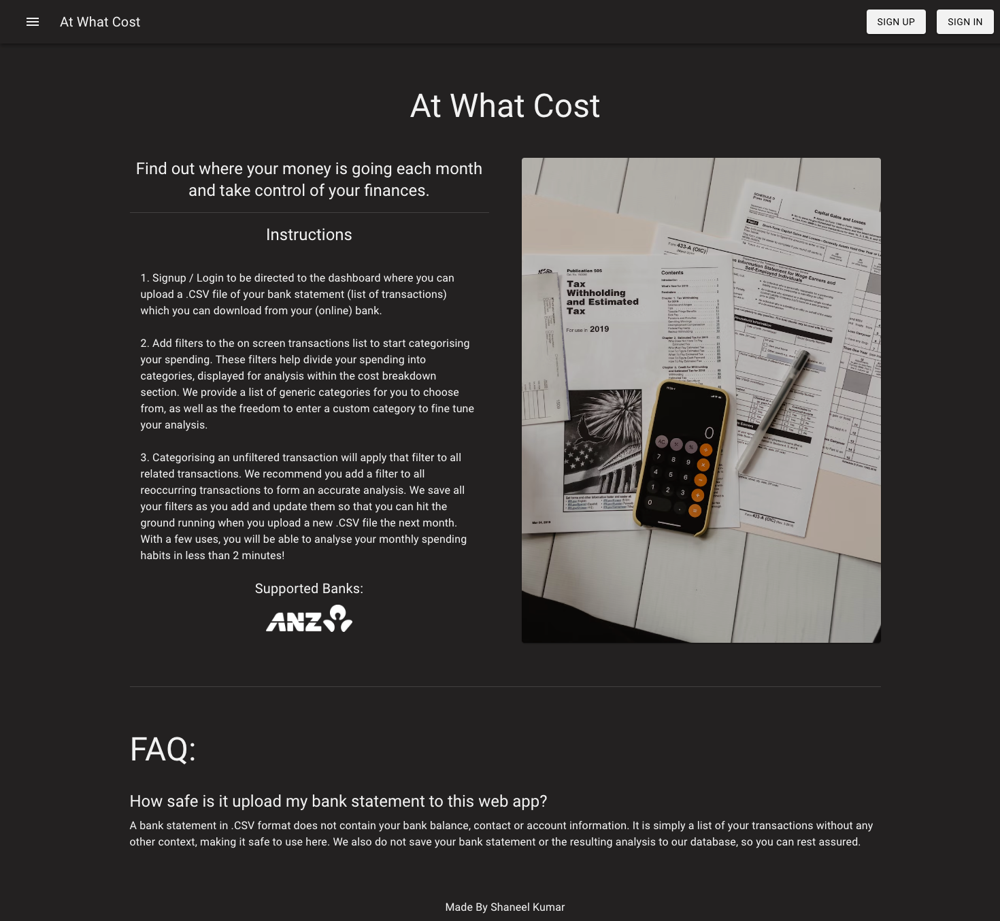
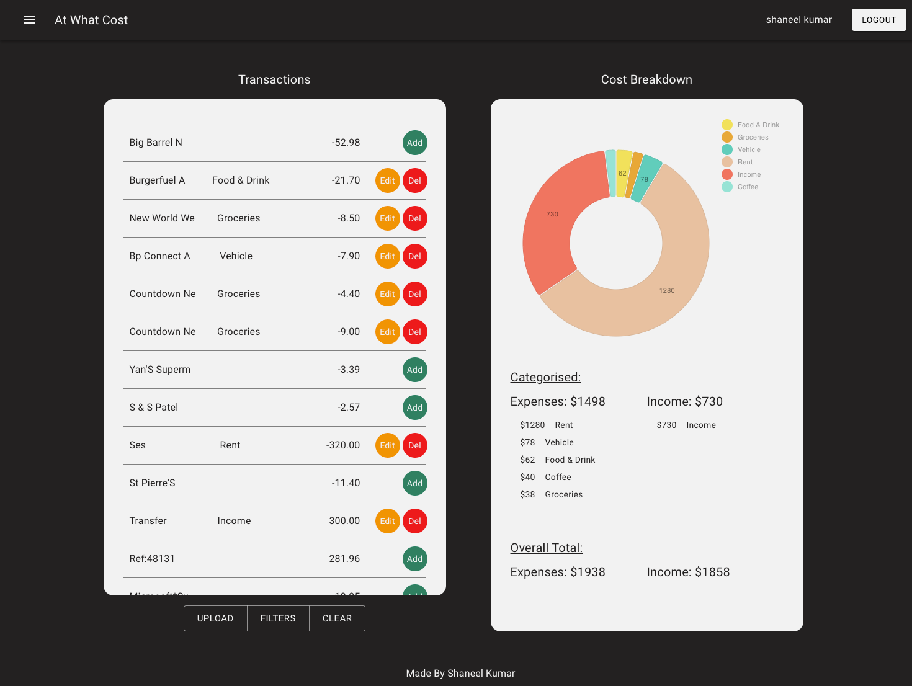
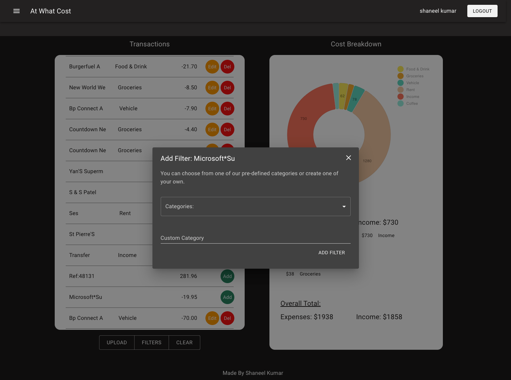

# At What Cost

### [Live Link](https://at-what-cost-fe.vercel.app/)

Analysing your finances can be a daunting task, especially if you don't want to go through the hassle of creating and updating an Excel spreadsheet every month. Understanding our spending habits is a great first step towards financial freedom and security, and it is something I have personally struggled with. "At What Cost" is a full stack web app that helps users break down their monthly spending habits so that they can make informed decisions about where they want their money to go.

Users can upload a bank statement in .CSV format to the app (obtainable from most major banks through their online app). The list of transactions are displayed in a modern UI that enables users to apply filters to each transaction. The app processes the user's filters and displays a cost breakdown that gives instant feedback about where a user's money is going. User can add, update and delete filters, and these changes are saved to a Postgresql database, made available by a separately hosted Node/Express server.

### [Link to Backend Repo](https://github.com/Vyonyx/at-what-cost-BE)

# Technology

- React
- Redux Toolkit
- RTK Query
- Typescript/Javascript
- Zod (Schema validation checker for data)
- JWT Auth
- Material UI
- Prisma (Query Builder to Postgres database)
- Express (API to database)

# Challenges

Aside from using the many different technologies that were new to me, I came across two challenges that I found particularly challenging.

1.  Hosting/Deploying. This project was my first attempt at trying to host an Express server online. I researched a few services, trying to find a free/cheap option that is also simple to use. I chose to host my server and an instance of Postgresql on a service called Railway that also allows static page hosting. It took me a few days to get the server online and I learnt a few lessons about trying to bring a backend together for production.
2.  Authorisation. I have previously implemented auth through a service like Google's Firebase or a framework specific auth solution that works well within it's ecosystem. I chose to try Auth0 as an independent solution for this project and managed to get authorisation and authentication working within my development environment. Unfortunately Auth0 stopped working in production due to a callback url error that I could not solve for nearly a week. The root of the issue was trying to get new versions of various technologies to work together with limited documentation. In the end I chose to implement auth myself using JSON web tokens. This experience was also a first for me and I managed to learn a new technique that I can use in future projects.

# Screenshots

### This app is partially mobile responsive (Desktop and Tablet).

## Home

## Dashboard

## Filter Options

